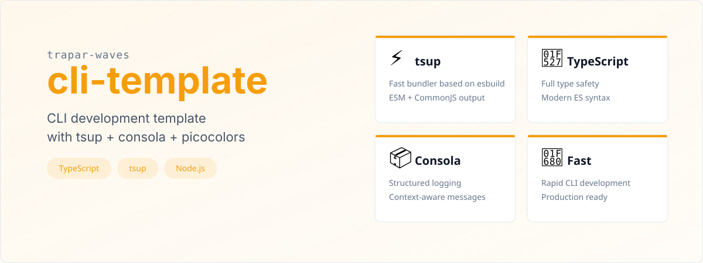

# @trapar-waves/cli-template


---

[English](../README.md) | [中文](./README-CN.md) | [日本語](./README-JP.md)

> Забудьте о рутинной настройке. Начните разработку CLI-инструмента за считанные минуты.



Готовый к использованию шаблон для разработки CLI-инструментов на Node.js. Всё предварительно настроено — компиляция TypeScript, сборка, система логирования, контроль качества кода и Git Hooks. Вам остаётся только сосредоточиться на бизнес-логике вашего CLI.

```bash
# Создайте CLI-проект мгновенно
pnpm create trapar-waves

# Начните разработку сразу
pnpm start
```

```
? Project name? › my-awesome-cli
my-awesome-cli
```


## Что вы получаете из коробки

| Возможность                       | Инструмент                    | Описание                                                                                       |
| --------------------------------- | ----------------------------- | ---------------------------------------------------------------------------------------------- |
| **Типобезопасность**              | TypeScript                    | Полная проверка типов + современный синтаксис ES, ошибки выявляются ещё до запуска             |
| **Быстрая сборка**                | tsup                          | Бандлер на основе esbuild — миллисекунды на генерацию оптимизированного CJS-файла              |
| **Структурированное логирование** | consola                       | Логирование с уровнями (info/warn/error), интерактивные подсказки, красивый вывод в терминале  |
| **Безопасный парсинг**            | destr                         | Парсинг аргументов CLI и конфигурационных файлов без риска получить исключение от `JSON.parse` |
| **Цвета в терминале**             | picocolors                    | Кроссплатформенный цветной вывод, 160+ цветовых кодов, нулевые зависимости                     |
| **Качество кода**                 | ESLint + @antfu/eslint-config | Готовые правила линтинга с автоисправлением, покрывающие TypeScript, JSON, Markdown и YAML     |
| **Git Hooks**                     | husky + lint-staged           | Автоматическая проверка перед коммитом — в репозиторий всегда попадает чистый код              |
| **CI/CD готово**                  | GitHub Actions                | Автоматическая публикация в npm + генерация changelog по тегам версий                          |

## Почему именно этот шаблон?

Большинство CLI-стартеров дают вам `console.log("hello")` и оставляют разбираться остальное самостоятельно. Этот шаблон предоставляет **полноценную среду разработки**:

- **Zero-config TypeScript** —— `tsconfig.json` уже оптимизирован для CLI-разработки, строгий режим включён
- **Сборка одной командой** —— `pnpm build` генерирует готовый к публикации `dist/run.js`
- **Рабочий процесс разработки** —— `pnpm start` запускает TypeScript напрямую через ts-node, без этапа сборки
- **Продакшн-энтри** —— `bin/run` — чистая точка входа Node.js, загружающая скомпилированный код
- **Автообновление зависимостей** —— бот Renovate автоматически поддерживает зависимости в актуальном состоянии


```
Язык         TypeScript 5.9    Типизированный JavaScript с современным синтаксисом
Бандлер      tsup 8.5          На основе esbuild, вывод ESM + CJS
Логирование  consola 3.4       Структурированные логи + интерактивные подсказки
Парсинг      destr 2.0         Безопасный парсер JSON-подобных строк
Цвета        picocolors 1.1    Лёгкая библиотека цветов для терминала
Линтинг      ESLint 10         Пресет @antfu/eslint-config
Git Hooks    husky 9           Управление Git-хуками
Менеджер     pnpm 10           Быстрый и экономный менеджер пакетов
```

Полный список зависимостей смотрите в [package.json](../package.json).


## Предварительные требования

- **Node.js** >= 18.x
- **pnpm** (рекомендуется) или npm/yarn

## Быстрый старт

```bash
# 1. Создайте новый проект из шаблона
pnpm create trapar-waves

# 2. Перейдите в директорию проекта
cd your-project-name

# 3. Установите зависимости
pnpm install

# 4. Начните разработку (TypeScript выполняется напрямую)
pnpm start
```

## Доступные скрипты

| Скрипт             | Команда                | Описание                                                         |
| ------------------ | ---------------------- | ---------------------------------------------------------------- |
| `pnpm start`       | `ts-node ./bin/run.ts` | Запуск CLI в режиме разработки (TypeScript напрямую, без сборки) |
| `pnpm start:node`  | `node ./bin/run`       | Запуск скомпилированного продакшн-кода                           |
| `pnpm build`       | `tsup-node`            | Продакшн-сборка → `dist/run.js`                                  |
| `pnpm build:watch` | `tsup-node --watch`    | Сборка в режиме отслеживания для разработки                      |
| `pnpm lint`        | `eslint . --cache`     | Запуск проверки ESLint                                           |

## Результат сборки

```bash
$ pnpm build

CLI Building entry: bin/run.ts
CLI Using tsup config: tsup.config.ts
CLI tsup v8.5.1
CLI Target: node18
CLI Building entry: { run: 'bin/run.ts' }
CJS dist/run.js       285 B
CJS ⚡️ Build success in 12ms
```

Результат сборки — один файл `dist/run.js`: без внешних зависимостей, быстрый запуск, готов к публикации в npm.


```
cli-template/
├── bin/
│   ├── run                    # Продакшн-энтри (#!/usr/bin/env node)
│   └── run.ts                 # Энтри для разработки (импортирует src/index.ts)
├── src/
│   ├── index.ts               # ← Ваша CLI-логика пишется здесь
│   └── logger.ts              # Настройка логгера (consola)
├── dist/                      # Скомпилированный вывод (генерируется tsup)
│   └── run.js                 # Единый забандленный CJS-файл
├── assets/readme/             # Визуальные ассеты для README
├── .github/workflows/         # CI/CD (релиз + публикация в npm)
├── .husky/                    # Git-хуки (lint перед коммитом)
├── tsconfig.json              # Конфигурация TypeScript
├── tsup.config.ts             # Конфигурация сборки
├── eslint.config.mjs          # Конфигурация ESLint
├── lint-staged.config.js      # Конфигурация Lint-staged
├── renovate.json              # Бот обновления зависимостей
└── package.json               # Метаданные проекта и скрипты
```

## Руководство по кастомизации

**Начните отсюда:** `src/index.ts` — замените демо-логику на вашу CLI-реализацию.

```typescript
// src/index.ts — замените на ваш CLI-код
import { logger } from "./logger";

export async function run() {
  const projectName = await logger.prompt("Project name?", {
    type: "text",
  });

  logger.log(projectName);
}
```

**Добавьте команды:** Установите CLI-фреймворк, такой как `commander`, `yargs` или `citty`, и подключите его в функции `run()`.

**Добавьте зависимости:** `pnpm add <package>` — tsup автоматически их запакует.

**Измените сборку:** Отредактируйте `tsup.config.ts` для включения sourcemap, изменения формата вывода или добавления точек входа.


Участие приветствуется! Вот как начать:

1. Fork репозиторий
2. Создайте ветку для новой функции (`git checkout -b feature/amazing-feature`)
3. Внесите изменения и убедитесь, что `pnpm lint` проходит без ошибок
4. Зафиксируйте изменения (`git commit -m 'Add some amazing feature'`)
5. Отправьте изменения в ветку (`git push origin feature/amazing-feature`)
6. Откройте Pull Request

> **Примечание:** При коммите pre-commit хуки автоматически запускают lint на файлах из индекса.


MIT License © 2025 Trapar Waves

## 👤 Автор

- **Rikka:** [admin@rikka.cc](mailto:admin@rikka.cc)
- **Профиль GitHub:** [Muromi-Rikka](https://github.com/Muromi-Rikka)

## 🔗 Ссылки

- **Репозиторий:** [https://github.com/Trapar-waves/cli-template](https://github.com/Trapar-waves/cli-template)
- **Issues:** [https://github.com/Trapar-waves/cli-template/issues](https://github.com/Trapar-waves/cli-template/issues)
- **npm:** [https://www.npmjs.com/package/@trapar-waves/cli-template](https://www.npmjs.com/package/@trapar-waves/cli-template)
